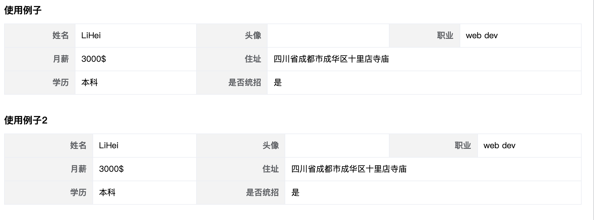

# form-table 表单式表格

表单式表格，使用时只需要传需要展示的标题和数据.

## 安装

```bash
n i j-form-table
```

在 vue 应用的入口文件中使用：

```js
import FormTable from 'form-table'
Vue.use(FormTable)
// 可全局配置 title 的宽度 默认是 120 单位 px
Vue.use(FormTable, { titleWidth: 150 })
```

## 常用 props

|      prop      |            说明             |          类型          | 是否必需 | 默认值 |         其他         |
| :------------: | :-------------------------: | :--------------------: | :------: | :----: | :------------------: |
|   titleList    |          组件配置           | `[]{title:'',prop:''}` |    是    |        |          ``          |
|      data      |    从该属性中取值来展示     |        `Object`        |          |        |                      |
|     title      |       整个组件的标题        |        `String`        |    否    |  `''`  |                      |
|   titleWidth   |          标题宽度           |        `Number`        |    否    | `120`  |      单位为`px`      |
| titleNumPreRow | 一行有几个`title`、`prop`对 |        `Number`        |    否    |  `3`   | 只能是`1,2,,3,4,5,6` |

## 基本用法

配置 `titleList` 和 `data` 即可展示数据；

```html
<template>
  <div>
    <FormTable title="使用例子" :data="data" :titleList="titleList" />
    <FormTable
      title="使用例子"
      :data="data"
      :titleList="titleList"
      :titleWidth="150"
    />
  </div>
</template>

<script>
  export default {
    name: 'App',
    data() {
      return {
        data: {
          name: 'LiHei',
          job: 'web dev',
          slary: '3000',
          address: '四川省成都市成华区十里店寺庙',
          education: '本科',
          isGood: 1
        },
        titleList: [
          { title: '姓名', prop: 'name' },
          {
            title: '头像',
            // 自定义 title 属性值
            titleTips: data => {
              return (data.image && '生成图，点击放大') || '暂无头像'
            },
            prop: 'image'
          },
          {
            title: '职业',
            prop: 'job'
          },
          {
            title: '月薪',
            prop: (h, data) => {
              return <span>{data.slary + '$'}</span>
            },
            enableCopy: true // 开启点击赋值内容
          },
          {
            title: '住址',
            prop: 'address',
            span: 2
          },
          {
            title: '学历',
            prop: 'education',
            span: 1
          },
          {
            title: '是否统招',
            prop: (h, data) => {
              const map = { 0: '否', 1: '是' }
              return <span>{map[data.isGood]}</span>
            },
            span: 2
          }
        ]
      }
    }
  }
</script>
```

效果


